# isotop

A living picture of your machine inside the terminal, in eleven views: a process
city, an orbital observatory, a rippling pond, a spacetime weather map, a race
track of CPU cores, petri dishes of cgroups, a ridgeline landscape of CPU
history, a globe of network connections, a coral reef, a chicken yard, and the system
log (the systemd journal, or the unified log on macOS) as Matrix rain. Written in
Rust for Linux and for macOS on Apple Silicon, with real process data and pixel
graphics through the Kitty graphics protocol. Ghostty is the primary target.

https://github.com/user-attachments/assets/05663db3-6c64-48bc-8696-45f166ce325c

| | | |
|:-:|:-:|:-:|
| 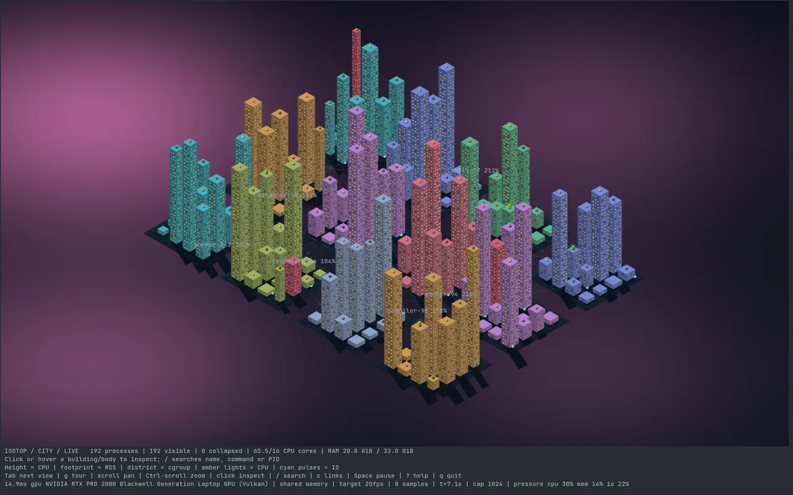<br>**1 City** | 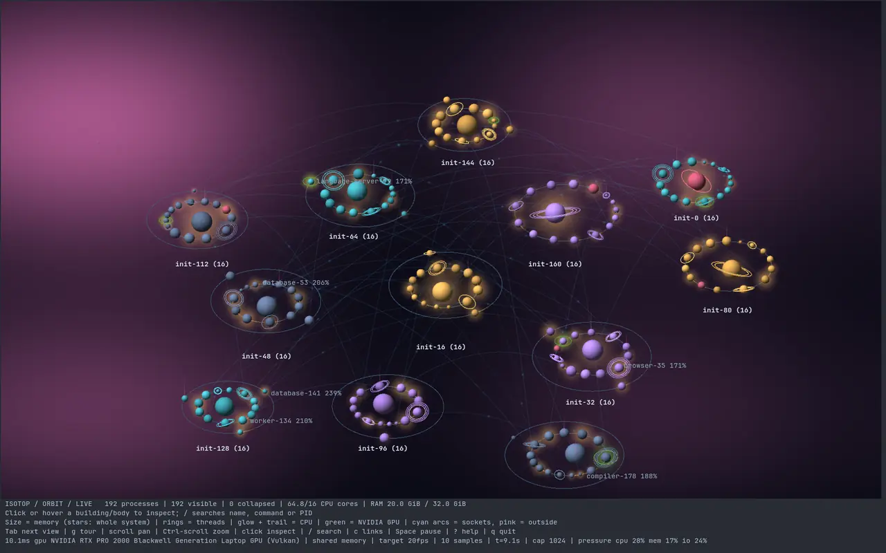<br>**2 Orbit** | 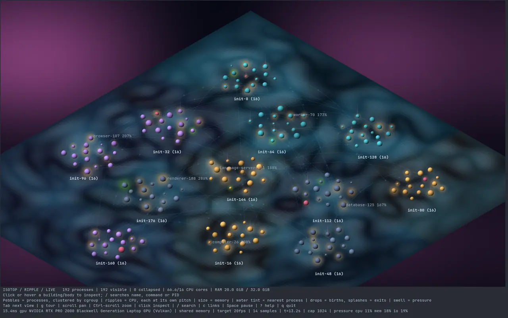<br>**3 Ripple** |
| 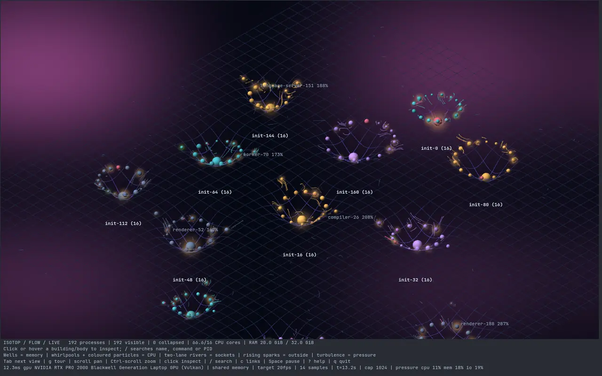<br>**4 Flow** | 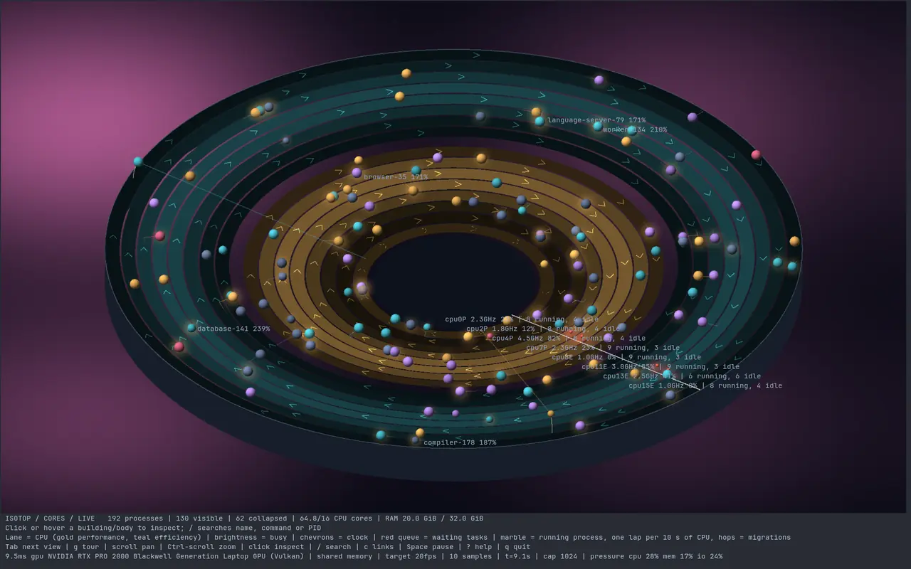<br>**5 Cores** | 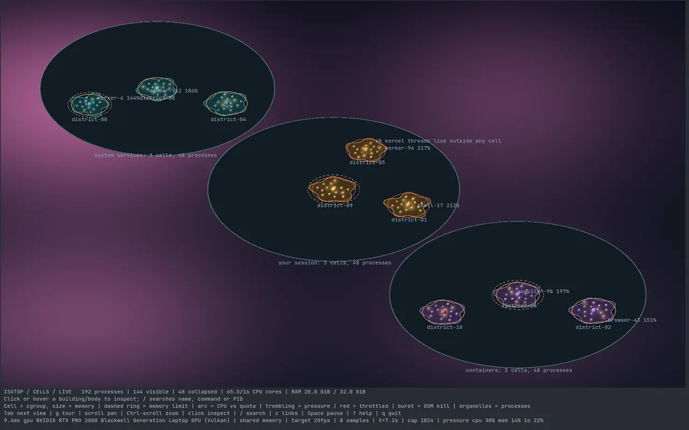<br>**6 Cells** |
| 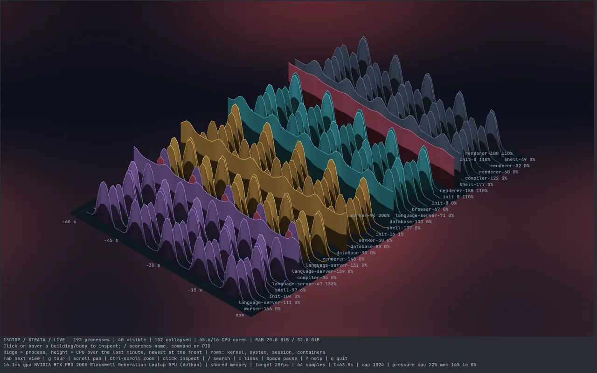<br>**7 Strata** | 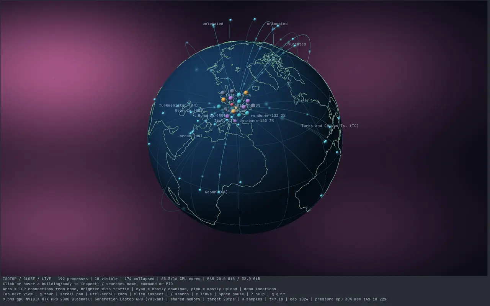<br>**8 Globe** | 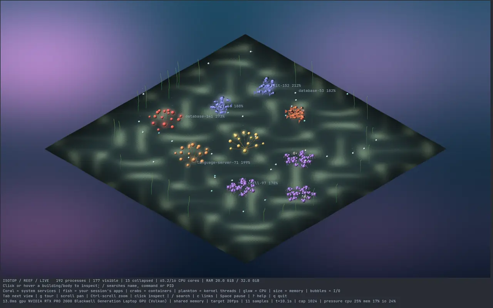<br>**9 Reef** |

The video at the top is a live session on a real machine, touring the views. The
other screenshots and recordings are of Ghostty running `isotop --demo`, the
synthetic workload; the coop image is a crop of a headless `--demo --output` render.

## Run

```sh
cargo build --release
./target/release/isotop --demo
./target/release/isotop
./target/release/isotop --view orbit      # also: city, ripple, flow, cores, cells, strata, globe, reef, coop, matrix
```

Run directly in a graphics-capable terminal such as Ghostty or Kitty; tmux does
not pass the graphics protocol through. The app queries graphics support on
startup and fails fast when it is missing. `--force-graphics` bypasses that query.

The scene renders at the window's native resolution up to 1920 pixels wide
(`--width` lowers the cap) and animation targets 10 FPS (`--fps` raises it, at a cost in CPU). Process data is sampled
once per second; sockets, cgroup accounting and NVIDIA GPU usage every two
seconds on a background thread. CPU uses a 1.5-second exponential smoothing time constant; 100% means one
fully occupied CPU core. Sizes ease toward each sample over 0.3 seconds;
inspector values remain the sampled measurements.

## Rendering

Every frame is a display list of screen-space primitives (triangles, lines,
shaded sphere impostors, glows, translucent beams, stars) over a sky. Two
rasterizers draw it with matching output:

- **GPU** (default): wgpu on Vulkan (NVIDIA, AMD, Intel) or Metal (Apple GPUs).
  `--gpu-power high` (default) prefers a discrete GPU, `low` an integrated one,
  which keeps a laptop's discrete GPU asleep. Software adapters are refused.
- **CPU**: a software rasterizer with a depth buffer. `--renderer cpu` forces it;
  `--renderer auto` falls back to it when no GPU is available or a GPU error
  occurs, and the status strip says which rasterizer drew the frame.

Frames reach the terminal through POSIX shared memory when the terminal can read
it (Ghostty and Kitty can, locally): no compression, no base64, almost no pty
traffic. Over SSH, or with `--direct`, frames are zlib-compressed inline instead.
The image sits below cells with a background colour, so popups and labels are
ordinary terminal text drawn over the scene.

isotop runs on Linux and on macOS on Apple Silicon. Process data comes from `/proc`
on Linux and from libproc and Mach on macOS. The renderer is the same on both. On
macOS some readings do not exist, and each view says what it lacks; see
[macOS](#macos).

## macOS

Build and run it the same way as on Linux:

```sh
cargo build --release
./target/release/isotop --demo
./target/release/isotop
```

Use Ghostty. Kitty works too. The GPU rasterizer draws through Metal. Frames go
through POSIX shared memory when the terminal can read it, which it can when it
runs on the same machine, and the startup probe falls back to inline frames when
it cannot (over SSH, for example).

**Privileges.** Without root, isotop can measure only your own processes. It still
lists the others, but macOS refuses to give their CPU or memory, and isotop never
guesses them; they are left out of the scene and counted beside the process count on the
first status line, for example `212 processes (+57 unreadable: run with sudo)`.
Run `sudo ./target/release/isotop` to see the whole machine. Under sudo, the
processes of the user who ran sudo (`SUDO_UID`) still count as your session. Sockets
follow the same rule: only processes isotop may read contribute links. Anyone may
read another process's pid, parent and name (`PROC_PIDT_SHORTBSDINFO`), so in Orbit
and Flow the processes directly under a parent isotop cannot read, such as launchd
without sudo, circle one hollow star named after it, labelled `launchd (unreadable)`
with their count, instead of each standing alone.

**Measured differently.** Memory is the physical footprint, the figure Activity
Monitor shows. Available memory is free plus inactive pages. CPU time comes from
Mach absolute time converted to nanoseconds. I/O is the disk bytes each process has
read and written. Priority is `51 - Mach priority`, so an ordinary application (31)
reads as 20 and a lower number runs first, as on Linux. Process state is R when a
thread is running, S otherwise, T for stopped and Z for zombies. The performance and
efficiency cores come from the IORegistry (`cluster-type`); if that cannot be read,
the lanes have no kind and are not guessed.

**Open files.** The coop's eggs are measured on macOS too. Each process's
descriptors come from `proc_pidinfo` (`PROC_PIDLISTFDS`), and each vnode among them
from `proc_pidfdinfo` (`PROC_PIDFDVNODEINFO`), which stats the file through the
descriptor. A regular file counts once by device and inode, and one whose link count
is 0 was deleted while still open: a rotten egg, with its size. The scan has the
same bounds as on Linux (4096 vnodes examined and 16 384 descriptors listed per
process, 65 536 per scan, resuming where it stopped), but only vnodes are examined,
since the listing already says which descriptors are sockets, pipes or kqueues, and
past 4096 the open count is estimated in proportion among the vnodes alone. A vnode
that is still open but cannot be read (a revoked device, a network server that fails
the stat) is estimated the same way and marks the count partial. A zombie holds no
files. Other users' tables need root, as their CPU and memory do, and
`kernel_task` is read like any process when isotop runs as root. macOS cannot ask a
filesystem for cached attributes only, as Linux does, so a network mount that stops
answering can hold up the background thread (sockets, files) while its attribute
cache is stale.

### What macOS does not report and how each view shows it

| Missing on macOS | How it shows |
|---|---|
| CPU and I/O pressure | The status line prints `n/a` for each: `pressure cpu n/a mem 0% io n/a`. The coop's heading noise comes from CPU variation only, and its legend says so |
| Memory pressure as a stall percentage | The kernel's pressure level stands in for it: normal reads 0, warning 25, critical 75. The sky's memory tint and the coop's fox eyes show that level, not a stall percentage |
| Last CPU of each process | macOS says only how each process's CPU time divided between the performance and the efficiency cores (`proc_pid_rusage`, `RUSAGE_INFO_V6`). Cores draws every running process as a marble that rides between the two groups of lanes by that share since the last sample, once it has one (a process seen for the first time, or one whose counters macOS will not give out, has no marble): in the middle of the gold lanes when all of it was on performance cores, in the middle of the teal lanes when all of it was on efficiency cores, and in between for a mix. It drifts there rather than hopping, and a process that used no CPU time keeps its place. The inspector gives the share, and the lane labels leave out the running and idle counts, which belong to a core. Where the split is not reported (a kernel without V6, or cores with no kind), Cores draws the lanes with their load and no marbles, and its legend says so. In the coop, running chickens share one trough instead of walking to the feeder of the core they ran on; the feeders are still drawn, brightened by how busy each core is |
| CPU clock | There is no clock per core. Each cluster's average clock is the cycles its cores ran divided by the CPU time they ran them in, summed over every process isotop can read between two samples, and every lane of that kind shows it, so a cluster's chevrons move together and the legend says "cluster clock". A cluster with less than 0.05 s of CPU time in the interval has no reading, and its chevrons pause. Virtual machines count no cycles; there the legend says "no clock readings" and the chevrons stay still. Without sudo the clocks come from your own processes only |
| Run queue | There is no run queue per CPU, so no red marbles at the start line. Each process's waiting threads come instead from its runnable time, which counts running as well, minus its CPU time: red beads trail its marble, one per thread waiting on average, with a faint red glow when any wait. The kernel brings runnable time up to date only when a thread is switched onto a core or blocks, so isotop counts only growth beyond the highest value it has seen; waiting can show a sample late. A process first seen while a thread had run for a long time without a switch can show that run as waiting once, so each reading is held to the process's thread count. After exec, whose new task keeps only one thread's counters, waiting starts over |
| cgroups | Cells groups processes by app bundle and user, with no limits, quotas, throttling, OOM events or pressure. The coop forms its flocks the same way, one per group, and no fox comes for an OOM kill; its legend says so |
| Per-connection socket traffic and RTT | Globe arcs are drawn without rates or round-trip times, and its legend says so. Loopback links have no byte counters, so in the coop peers pull by co-activity only, the smaller of the two CPUs and only when both are busy |
| Uninterruptible sleep (D) | Never shown, so no red buildings, and no mud puddles in the coop |
| File locks | There is no table of who holds or waits for a lock: `fcntl(F_GETLK)` only tests a range of a file the caller has open itself. No hen broods or queues at a nest in the coop, and its legend says "no file lock table: no brooding or queueing". Open files and files deleted while open are measured; see above |
| GPU memory | Not read. Apple GPUs share memory with the CPU, and there are no green GPU beacons or halos |
| The systemd journal | Matrix follows the unified log instead; see below |

**Kinds.** Each process is one of four kinds, which set its colour. `kernel_task`
(pid 0) is the kernel. A process is a container if its executable is a
virtualization helper: Virtualization.framework (`com.apple.Virtualization.VirtualMachine`),
OrbStack, Docker, Lima (`limactl`), UTM and other QEMU (`qemu-system-*`) processes,
`vfkit` and `krunkit`. Otherwise it is a system process if its uid is below 500 or its
executable is under `/System`, `/usr` (except `/usr/local`), `/bin`, `/sbin` or
`/Library/Apple`. Otherwise it belongs to your session if it runs under your uid, and
to the system if it does not.

**Groups and parents.** A process's group is the outermost `.app` bundle in its
path, so the helpers inside `Safari.app` all group with Safari; without a bundle it
is the executable's name. Cells and the coop use the group, with the kind, in place
of a cgroup. A process's parent is the app responsible for it, as macOS reports it
through a private function isotop looks up at run time, so helpers that launchd
started sit under their app rather than under launchd. A process whose real parent
already descends from that app keeps its real parent, so a command in a terminal stays
under its shell. If the function is missing or would create a loop, the real parent
is used.

**The unified log.** Matrix runs `log show --last 2m` and then `log stream` (both as
JSON) on a background thread, so the rain starts full as it does on Linux. Lines read
`process[pid]: message`. Severity comes from the message type: Fault is critical and
Error is an error (both red), Default is a notice and Info is information (both
green), Debug is debug (teal), and anything else counts as a notice. The unified log
has no warning level, so nothing is amber.

## Worlds

The scene is real 3D geometry seen through an orthographic camera: isometric by
default, free to rotate and tilt between a low angle and top-down. Tab cycles
the eleven views in order, the number keys 1 to 9 jump straight to the first nine
and 0 to the matrix. The coop is reached with Tab, Shift+Tab or `--view coop`.
Orbit and flow share one layout, so a process sits in the same place in each. Views
that grow as data arrives (cores, cells, strata, globe, reef, coop) keep the camera
framed until you move it; Home, Tab or a number key frames them again.

### City

- Height: smoothed process CPU usage, `1 + 44 * cpu / (cpu + 100)` world units
  against 4-unit plots: idle processes are low blocks, one busy core is a tower
  about six plots tall, and multi-core work climbs towards eleven.
- Footprint: bounded square-root memory scale (resident set).
- District: service/cgroup, split into fixed 16-building blocks as needed.
- Windows and rooftop lights: decorative CPU activity cues; green beacons:
  processes using the NVIDIA GPU.
- Cyan ground pulses: attributed disk I/O activity when readable.
- Pink: zombie; orange: stopped; red: uninterruptible sleep.

Plots stay fixed as resources change. Exited processes release their plots.
Blocks grow along square shells so newly allocated districts do not relocate
existing ones.

### Orbit

- Colour: slate kernel threads, teal system services, amber processes in your
  session, violet containers (from kernel thread flags and the cgroup path).
- Size: volume proportional to memory (radius is the cube root), so a 1 GiB
  process is about five times as wide as a 6 MiB one. A body with children is
  sized by the memory of its whole subtree, so stars carry their systems' mass.
- Rings: Saturn rings for threads, one more ring per fourfold thread count.
- CPU: a warm glow and a comet trail along the orbit. Green glow and halo: NVIDIA
  GPU memory.
- Children orbit their parents on Keplerian ellipses with the parent at one
  focus. Motion follows Kepler's equation, so bodies speed up near periapsis, and
  periods follow T ~ sqrt(a^3 / M): wider orbits are slower and heavier parents
  pull their children round faster (clamped to 8 s to 10 min).
- Branches hanging off a top-level process (init, kthreadd) become separate solar
  systems; leaf processes stay in orbit, so kernel threads form one ringed system
  around kthreadd.
- Large sibling sets fill concentric shells that share one eccentricity and
  orientation, so they are scaled copies of each other and never cross; siblings
  on a shell share one ellipse and keep their order.
- Systems are packed around the centre, largest first, and the whole galaxy
  revolves about its memory-weighted barycenter like satellite galaxies:
  systems whose rings overlap turn together, and detached outer systems turn at
  their own slower Kepler rate (once every 2 to 15 minutes), so they never
  collide. A system only moves out of its place on the wheel when it outgrows
  the room reserved for it.

Four levels are drawn per system; deeper processes are counted as collapsed.

### Ripple

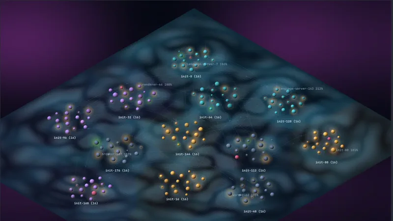

The machine as a pond: a damped 2D wave equation (nine-point stencil, absorbing
border) simulated on a grid and drawn as a smoothly lit surface.

- Processes are pebbles, clustered by cgroup like handfuls thrown into the
  water. A pebble keeps its place for life; a cluster moves only when it
  outgrows the open water around it.
- Busy pebbles drive ripples at their own pitch, louder with more CPU, so a
  cluster's rings interfere and spread out to its neighbours.
- Pebbles float on the surface, sized by memory.
- Every patch of water belongs to its nearest process and is tinted by it;
  hovering the water names its owner.
- New processes drip; exiting processes splash. Pressure raises a swell.

### Flow

Spacetime weather: particles traced through a velocity field over a sheet that
memory bends.

- Each solar system bends a gravity well as wide as the system and deeper for
  more memory; heavy processes add their own dimples. The fabric brightens and
  turns violet with depth.
- Busy processes spin whirlpools and emit particles in their colour.
- Socket links become two-lane rivers between the processes that talk, one lane
  each way, carrying traffic in each end's colour.
- Connections that leave the machine send sparks rising off the sheet; exits
  burst outward; pressure adds turbulence.

### Cores

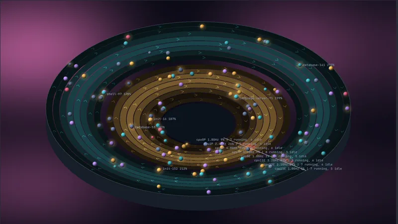

A race track with one lane per CPU: performance cores inside in gold, efficiency
cores outside in teal (from `/sys/devices/cpu_core` and `cpu_atom` on hybrid
Intel CPUs), banked like a velodrome.

- Lane brightness: how busy that CPU was (`/proc/stat`). Chevrons run at its
  clock speed (`cpufreq`).
- Red marbles queued behind the start line: tasks waiting for that CPU, from
  run-queue delay in `/proc/schedstat`.
- Marbles: running processes, sized by memory. A marble covers one lap per 10
  seconds of CPU time, so a process using a full core laps every 10 seconds. When
  the scheduler moves a process to another CPU, its marble hops across lanes;
  the inspector counts the hops.
- Idle processes stay off the track and only count towards their lane's label.
- On macOS, which reports no last CPU, marbles ride between the performance and
  efficiency lanes by their share of performance-core time, chevrons run at each
  cluster's clock, and red beads trail a marble for its waiting threads; see
  [macOS](#macos).

### Cells

Every cgroup is a cell in a petri dish: one dish each for system services, your
session and containers. Accounting comes from the cgroup v2 files
(`memory.current`, `memory.max`, `cpu.stat`, `cpu.max`, `memory.events`,
`pids.current`, `*.pressure`).

- Cell size: the cgroup's memory. A dashed ring marks its memory limit, reddening
  as usage nears it; an arc around the membrane shows CPU use against its quota.
- The membrane trembles with the cgroup's pressure, flashes red when its CPU
  quota throttles it, and bursts when the OOM killer strikes inside it.
- Organelles: its processes, with the largest as the nucleus. Kernel threads
  belong to no cell and are only counted.

### Strata

The last minute of CPU use as a ridgeline landscape. Each of up to 40 busy
processes is a ridge whose height traces its CPU over time, with now at the
front edge; rows run from kernel threads at the back through system services and
your session to containers at the front. A process keeps its ridge, in the same
row, while it stays busy. History is recorded whichever view is shown, so the
landscape is already a minute deep when you switch to it.

### Globe

Where the machine's TCP connections go. The world turns once every five minutes;
arcs rise from home to every remote place, brighter with more traffic, cyan when
mostly downloading and pink when mostly uploading, with pulses travelling the way
the bytes flow. Processes with connections hover above home, and their inspector
lists each connection with its round-trip time and rates (from the kernel's
`tcp_info` through sock_diag).

Locations come from a local GeoIP database, read the first time the globe is
shown; nothing is sent anywhere.

- A city-level MaxMind-format database gives cities: pass `--geoip PATH`, or put
  one in `~/.local/share/isotop/` (any `*.mmdb`). DB-IP's free
  [IP to City Lite](https://db-ip.com/db/download/ip-to-city-lite) works and is
  credited on screen as "IP Geolocation by DB-IP", as its CC BY 4.0 license
  requires; GeoLite2 City in `/usr/share/GeoIP` or `/var/lib/GeoIP` is found
  automatically.
- Otherwise the legacy country database many distributions ship
  (`/usr/share/GeoIP/GeoIP.dat`) places connections at country label points.
- Private, loopback and carrier-grade NAT addresses have no location;
  connections the database cannot place circle the north pole.
- Home is the system time zone's city (`/etc/localtime` and `zone1970.tab`), or
  `--home LAT,LON`.

Coastlines and country label points are from [Natural Earth](https://www.naturalearthdata.com/)
(public domain).

### Reef

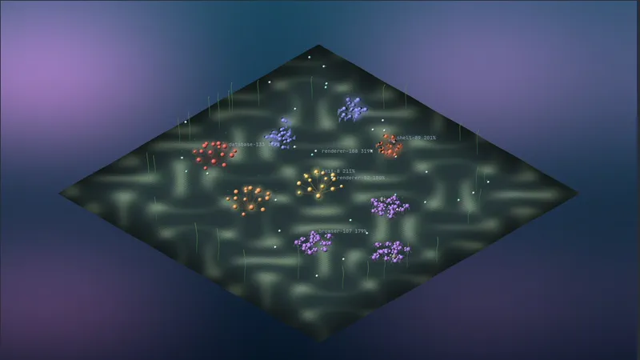

The machine as a coral reef under a sea sky. System services grow as coral
colonies, one per cgroup, with a polyp per process that glows with CPU; your
session's apps swim in schools whose speed follows their CPU; containers are
crabs scuttling on the sand; busy kernel threads drift as plankton. Size follows
memory everywhere, I/O rises as bubbles, and zombies float belly-up.

### Coop

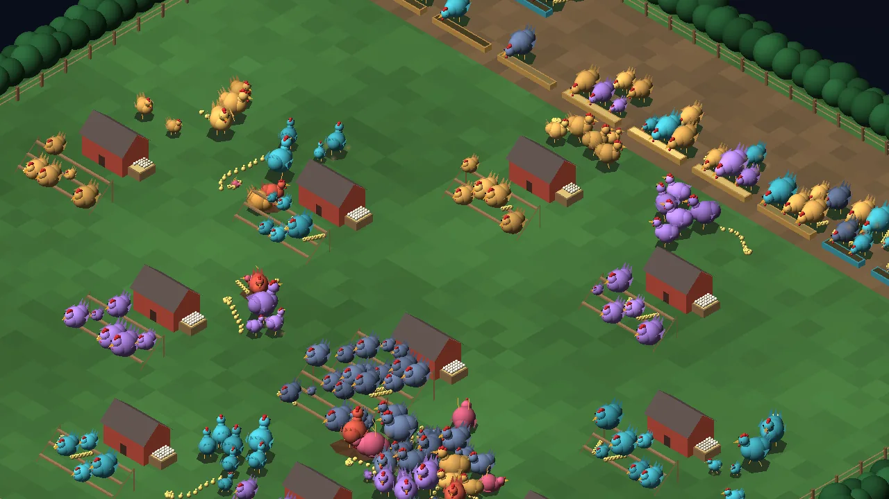

A fenced chicken yard in which every process is a chicken in a Vicsek flock: each one steers by the average heading of its flock mates, plus noise.

| Visual element | Measured source | Transform |
| --- | --- | --- |
| Chicken | Process | One per drawn process; picking and the inspector use the process |
| Body radius | Memory (RSS; the physical footprint on macOS) | (0.12 × ∛MiB) clamped to 0.3 to 1.2 (volume follows memory; about 16 MiB and below share the smallest size (0.3 / 0.12 = 2.5, and 2.5³ = 15.6), 1000 MiB and above the largest), scaled by 0.3 + 0.7 × growth while it hatches |
| Plumage | Kind and state | The same colours as the other views; zombies pink, stopped orange, uninterruptible sleep red |
| Flock and henhouse | cgroup (the process group if there is none; kernel threads share one "kernel" flock) | One flock and one henhouse per group, labelled with the group name |
| Perch seat | Seat number in the flock | Fixed ladder grid around the henhouse, nearest seats first |
| Roosting on a perch | CPU below 0.3 % | Roosts under 0.3 %, leaves above 0.8 %, a newcomer roosts under 0.5 % |
| Foraging speed | CPU | 0.6 + 3.4 × cpu / (cpu + 25) units per second |
| Heading noise | CPU variation over 30 samples, CPU pressure | 0.5 + 0.5 × min(CV, 2) + 5.5 × psi / (psi + 15) radians, at most a full turn; without pressure readings the pressure term is dropped and the CPU-variation term still applies |
| Pull towards a socket peer, measured | Loopback TCP bytes per second | w = min(log2(1 + B/s ÷ 1024) / 10, 1.5); an idle connection gives 0; a connection first seen since the previous 2 s scan counts all the bytes it has received over that interval, and on the very first scan nothing is measured yet |
| Pull towards a socket peer, unmeasured | CPU of both ends | w = 0.8 × min(cpu_i, cpu_k) / (min + 25) |
| Feeders | Per-core CPU list (the core count if there is none) | Sorted by kind and id; performance cores get 3 slots and a gold trough, efficiency cores 2 and teal, unknown kinds 2 and neutral |
| Grain brightness | Core busy fraction | Tint 0.25 + 0.85 × busy |
| Feeding at a feeder | Running state, last core | A queue per feeder ordered by priority, then identity; an unknown core goes to the first feeder. A long queue wraps into at most three columns in the feeder's own lane (straight back, then right, then left) and packs tighter if it still does not fit, so it stays inside the fence and apart from the next feeder's queue |
| Pecking rank | Priority and nice | Shown in the inspector |
| Frozen, crouched | Stopped or traced state | Held in place without noise |
| Mud puddle | Uninterruptible sleep | Does not move |
| Feet up | Zombie | Does not move |
| Clutch of eggs in the nest box | Open regular files of the flock's members (`/proc/<pid>/fd`; `proc_pidfdinfo` on macOS) | round(log2(1 + Σ open files)) eggs, at most 16: 1 file lays 1 egg, 7 lay 3, 140 lay 7, and 46 340 or more fill the clutch. Each member counts a file once however many of its descriptors refer to it. A state, not events: the clutch shrinks when files close. Members whose descriptor tables are unreadable or not read yet add nothing, and the nest's inspector line says how many |
| Rotten eggs, cracked and olive | Files deleted while still open (link count 0) | One per deleted file (by device and inode, so a rotated log that several members hold open is one egg), at most 8 shown in front of the clutch; the inspector gives the count and the bytes held |
| Brooding by the nest | Holding a file lock or lease (`/proc/locks`; macOS has no lock table, so none brood there) | A holder that is not running sits on a straw pad beside her own house's nest box, clear of its eggs |
| Queueing at a nest | Blocked on a file lock (a `->` line in `/proc/locks`) | Walks to the nest of the house of the process holding the lock, whatever its own flock, and queues beside it after the brooders, with a faint line to the holder |
| Dust puffs | Read rate | min(5, 1 + ⌊log2(rate / 64 KiB)⌋) puffs above 64 KiB/s |
| Chicks | Threads | min(threads − 1, 12), following the hen along her trail |
| Fox | Rise in a unit's OOM kill count | One to three foxes run for 3 s at the largest member that vanished in the last 4 s (or two and a half sampling intervals, if longer) |
| Fox eyes | Memory pressure | min(6, 1 + ⌊psi / 10⌋) pairs above 0.5 %, 3 × (1 − psi / (psi + 20)) + 0.4 units outside the fence |
| phi in the legend | Foragers | \|Σv\| / Σ\|v\| |
| Inspector notes | Open and deleted files, locks, bytes written, write and read rates, nice | Exact counts behind the capped clutch and rotten eggs, the lock holder a waiter waits for, and the dust and feeding lines |

Decorative: the grass grid and the dirt band under the feeders, the hedge, the fence posts and rails, the henhouse roof and door, straw in the nests and the straw pads beside them, the cracks on rotten eggs, the brooding pose, ladder stringers, ground shadows, the walking stride, the pecking head bob, the chick hop, the swirl of the dust puffs, the blink of the fox's eyes, and the fox's gallop and shape.

**The Vicsek rule.** The update is synchronous: every forager's new heading is computed from the old state of its flock mates within 4 units, and then all are applied together. Only chickens of the same flock count as neighbours, found through a spatial hash. Noise comes from the process's CPU variation over its last 30 samples and from system CPU pressure, so a steady machine holds its flocks together and a stalled one scatters them. The order parameter phi = |Σv| / Σ|v| is 1 when every forager heads the same way and near 0 when headings are random. It is shown in the legend for the whole yard and in the inspector per flock. The fence is a reflecting boundary, and a henhouse pulls foragers back when they stray more than its range. The fence hugs the henhouses' reserved discs but only ever moves outward during a session: a flock at the edge arriving or leaving does not move the fence, the feeders along it or the fox eyes around it.

**Peers.** A chicken is pulled towards the processes it holds sockets with. Loopback TCP has per-link byte counters, so those links pull by measured bytes per second. The kernel keeps no per-link byte counters for Unix sockets, so they pull by co-activity instead: the smaller of the two CPUs, and only when both ends are busy.

**Feeders and the pecking order.** Each CPU core is a feeder. A running chicken walks to the feeder of the core it last ran on and pecks while it is in state R, and leaves after two consecutive samples in which it was not running. When a feeder is full, the rest queue, and a lower priority number goes first, so real-time tasks eat before nice ones.

**Roles.** Each chicken takes the first role that applies: zombie, frozen (stopped or traced), stuck (uninterruptible sleep), feeding (running), queueing for a lock, feeding (the two-sample hold), brooding (holding a lock), roosting, foraging. So a running lock holder still feeds, and an idle one broods instead of roosting. A request blocked on a lock sleeps, so a running process that the lock table (read up to 2 s earlier) still lists as blocked has been granted the lock, and feeds.

**Seats by the nest.** Brooders, then the hens queueing there, take seats in a grid east of the nest box, a column at a time from the box's north end, with the first column against the box. The seats stay inside the flock's reserved disc and off its ladders, so a long queue never reaches another flock or the feeders: when more hens come than fit, the grid closes up and they crowd together.

**Eggs and locks.** The nest box of each henhouse holds a clutch for the regular files its flock holds open, and a rotten egg for each of those files that was deleted while still open: its disk space is not returned until the file is closed, which is how a rotated log can keep gigabytes. Both are read every 2 s on the background thread. A descriptor counts as an open file when its link names a path (memfds excluded) and a stat through it finds a regular file; it is deleted when the link ends in ` (deleted)` and the stat finds no links left. Files are told apart by device and inode, so descriptors on one file count once. The stat takes the attributes the kernel already holds (`AT_STATX_DONT_SYNC`), so a hung network or FUSE mount cannot stall the background thread. The scan examines at most 4096 descriptors and lists at most 16 384 per process, and lists at most 65 536 per scan: past that a process's open files are estimated in the proportion found among the examined ones, and its deleted files are counted only among the examined ones, so they are never invented. The inspector then says "about" the open files and "at least" the deleted ones. A process is only scanned while a whole per-process share of the budget remains; otherwise the scan stops and the next one resumes at that process, and processes not reached keep their previous counts or show as not read yet. File locks come from one read of `/proc/locks`: POSIX, flock and lease lines count as held by their pid, and each blocked request (`->`, nested deeper for a request queued behind another) is mapped to the holder of the lock line above it. A request blocked on a lock no process can be named for queues at its own nest.

**The fox.** When a unit's `oom_kills` count rises, a fox runs to the largest member (by memory) that vanished in the last 4 seconds, or two and a half sampling intervals when `--sample-ms` is longer, and takes it. The window exists because cgroup counters are read every 2 s on a background thread, so the count can rise a sample or two after the process disappears from the list; each victim is claimed by one kill only. If no member vanished, the fox leaves empty-mouthed. Kills recorded while another view is shown are dropped once they are older than a fox's run, so switching to the coop does not replay them. Memory pressure puts fox eyes in the hedge: more pairs and nearer the fence as pressure grows, and foragers near them flee.

**What cannot be measured.** The legend says so. Without CPU pressure (kernels without PSI) the pressure term of the noise is fixed; the CPU-variation term still applies. I/O counters of other users' processes are unreadable without privileges, so those chickens raise no dust, and the legend counts them ("I/O unreadable for N"). The same goes for their descriptor tables: their open files add nothing to the clutch, and the legend says "no files for N (permissions)". A process the file scan has not reached yet (just started, or past a scan's budget) is not counted there; its inspector says "open files not read yet". Kernel threads hold no descriptors and count as having no files. Open file description (OFD) locks belong to an open file, not a process, and `/proc/locks` reports them with pid -1: no hen broods for them, a request blocked on one has no holder to walk to and queues at its own nest, and the legend counts them. macOS has no lock table at all, so there no hen broods or queues, and the legend says so in place of the brooding and queueing entries.

**Fixed time step.** The yard advances in whole 20 Hz steps of wall-clock time, so the frame rate does not change how a flock moves; a gap longer than half a second, such as a pause, is capped at half a second.

The view is a port of [tfpickard/chicken](https://github.com/tfpickard/chicken) with its four bugs fixed: it updated headings in place instead of synchronously, its alignment readout summed speed magnitudes so it was always 1, it stepped once per frame instead of by time, and it searched neighbours in O(N²).

### Matrix

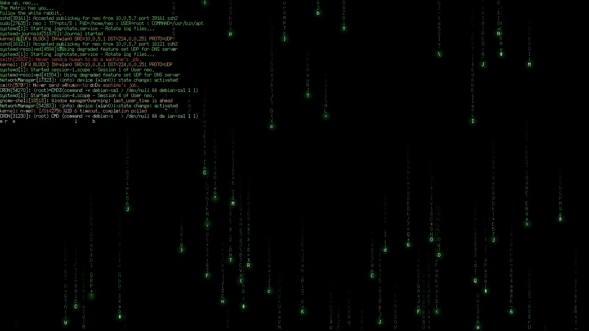

The systemd journal decoded out of digital rain (on macOS, the unified log; see
[macOS](#macos)). `journalctl -f` runs on a
background thread from the moment the view is first shown, starting with the
last 200 entries. The screen is a log of `source[pid]: message` lines written
horizontally, newest at the bottom, coloured by severity: red for errors and
worse, amber for warnings, green for notices and information, teal for debug.
Each character resolves only when a falling stream of rain passes over it,
flashing white before it settles; every new line brings a shower down onto its
own characters, and anything the rain misses appears after three seconds.
Between the lines falls cmatrix-style rain of flickering green glyphs. Lines
are written one at a time, faster when they queue up; a flood that outruns the
log is trimmed, and the status strip counts what was skipped. The camera and
process controls do nothing here. Glyphs are the public-domain X11 misc-fixed
7x14 font, and `--demo` writes synthetic entries. Without the `adm` or
`systemd-journal` group, journalctl shows only your own user's journal.

### Links and weather

Socket links come from the kernel: loopback TCP pairs from `/proc/net/tcp{,6}`
and connected Unix-socket peers from the sock_diag netlink interface, matched to
processes through `/proc/<pid>/fd`. Only processes whose descriptors isotop may
read appear. In orbit, ripple and city they are cyan arcs with travelling pulses
(`c` cycles all / highlighted / off); TCP connections to other machines rise as
pink beams. Links of the selected, hovered or toured process glow.

The sky is tinted by pressure stall information from `/proc/pressure`: amber for
CPU, crimson for memory, blue for I/O.

NVIDIA GPU memory comes from NVML, loaded at run time. A runtime-suspended GPU has
no processes, so isotop does not query it and never wakes a laptop's discrete GPU
for monitoring.

### Life

New processes fly out of their parent (orbit) or rise from their plot (city).
The processes already running when isotop starts bloom in the same way. Exiting
processes leave a brief flash and an expanding ring.

### Labels, hover, and the tour

System names (`init`, `systemd --user`, `kthreadd`, ...) and the busiest
processes are labelled; `l` toggles labels. Labels are at most 15 cells wide, so
a longer name (macOS allows 31 characters) is cut after 13 characters and ends in
`..`, and Apple's own `com.apple.` prefix is dropped. Two labels on the same row
always have a blank column between them; one that would touch another is left
out. Hovering a body or building shows its full name and a short description of
what it is. After 20 seconds without input
(`--tour`, `0` disables), a guided tour eases the camera between notable
processes: system stars, the busiest, and the largest. Each gets a callout with
a pointer. On the globe, the tour and search also turn the camera so the process
faces you, because the world's spin carries home to the far side for half of
every turn. `g` starts the tour at any time, even with the idle tour disabled.
Any key or mouse movement ends the tour.

## Controls

| Key / mouse | Action |
| --- | --- |
| Tab | Next view: city, orbit, ripple, flow, cores, cells, strata, globe, reef, matrix, coop |
| Shift + Tab | Previous view |
| `1`-`9`, `0` | Jump to a view in that order |
| Two-finger scroll / wheel | Pan (vertical and horizontal) |
| Ctrl + scroll | Zoom towards the pointer |
| Alt + scroll | Rotate |
| Right or middle drag | Rotate (horizontal) and tilt (vertical) |
| Arrows or WASD | Pan |
| `+` / `-` | Zoom |
| `Q` / `e` | Rotate a quarter turn counterclockwise / clockwise |
| PgUp / PgDn | Tilt up / down |
| `t` | Toggle top-down and isometric |
| Home | Fit scene |
| `r` | Reset camera and fit |
| Hover | Name and description of the process under the pointer |
| Left click | Select the nearest process and open its inspector popup |
| Left click on empty space | Close the popup |
| Left drag | Pan |
| `l` | Toggle labels |
| `h` | Hide or show the status panel, giving the scene the whole terminal |
| `g` | Start the guided tour now; `g` again (or any input) ends it |
| `c` | Socket links: all, highlighted only, off |
| `/` | Search name, command, or exact PID |
| Tab while searching / `n` afterward | Next match |
| Enter | Accept search |
| `f` | Focus selected process and descendants |
| Esc | Leave search, close the popup, or clear subtree focus |
| Space | Pause / resume |
| `[` / `]` | Previous / next retained snapshot |
| `?` | Toggle help |
| `q` / Ctrl-C | Quit |

Terminals deliver touchpad scrolling as wheel events but do not forward pinch or
rotate gestures, so Ctrl-scroll and Alt-scroll stand in for them. Camera moves
from keys, fitting, focusing, search, and the tour ease into place; direct mouse
gestures apply immediately.

Pause freezes collection and animation; up to 120 snapshots are retained by
default. When the terminal supports SGR-Pixels mouse reporting (Ghostty and
Kitty do), hover and clicks are pixel-precise; otherwise clicks pick the nearest
object within about a cell. The popup inspector follows the selected process and
reports exact values, threads, NVIDIA GPU memory, the memory of the system a
body anchors, socket counts, command line, parent, and cgroup. Process identity
combines PID and start time to distinguish PID reuse.

## Headless rendering and performance

```sh
./target/release/isotop --demo --output city.png
./target/release/isotop --demo --view flow --output flow.png
./target/release/isotop --demo --processes 1000 --benchmark 120
./target/release/isotop --demo --renderer cpu --benchmark 120
```

`--time` fixes the synthetic workload time for repeatable screenshots. PNG output
uses a 16:9 viewport; ripple, flow, cores, reef and coop simulate four seconds first so
the media and creatures have settled, demo strata replays a minute of
history, and demo coop replays 30 seconds of samples for CPU variation. Live headless output takes two samples to measure CPU, so live strata
shows only its newest slice.
Benchmarks measure scene recording and rasterization, excluding terminal
transport. `--duration 5` runs an interactive session for five seconds and
reports presented frame throughput after restoring the terminal.

The scene admits at most 1024 processes by default (`--limit` changes this).
Selection can bring a process beyond the cap into the scene.

## Development

```sh
cargo fmt --check
cargo clippy --all-targets -- -D warnings
cargo test
cargo build --release
python3 scripts/smoke_terminal.py
```

The smoke test emulates a graphics-capable terminal through a pseudo-terminal,
reads frames both inline and through shared memory, and exercises interactive
controls and restoration. Visual quality, flicker, and display latency should
also be checked in Ghostty.

CI builds and tests on Linux and on macOS (`macos-15`, Apple Silicon). The macOS
code can be type-checked from Linux with
`cargo clippy --target aarch64-apple-darwin --all-targets -- -D warnings`.

## Next milestones

- Zoom-dependent aggregation for very dense systems.
- Optional GUI presentation using the same monitoring and scene model.
