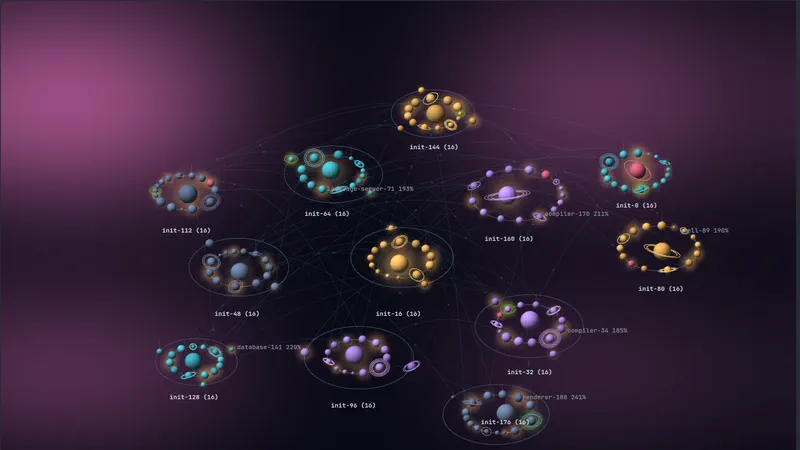

# isotop

A living picture of your machine inside the terminal, in ten views: a process
city, an orbital observatory, a rippling pond, a spacetime weather map, a race
track of CPU cores, petri dishes of cgroups, a ridgeline landscape of CPU
history, a globe of network connections, a coral reef, and the systemd journal
as Matrix rain. Linux-first, written
in Rust, with real process data and pixel graphics through the Kitty graphics
protocol. Ghostty is the primary target.



| | | |
|:-:|:-:|:-:|
| <br>**1 City** | <br>**2 Orbit** | <br>**3 Ripple** |
| <br>**4 Flow** | <br>**5 Cores** | <br>**6 Cells** |
| <br>**7 Strata** | <br>**8 Globe** | <br>**9 Reef** |

Screenshots and recordings are of Ghostty running `isotop --demo`, the synthetic
workload, so they show no real machine.

## Run

```sh
cargo build --release
./target/release/isotop --demo
./target/release/isotop
./target/release/isotop --view orbit      # also: city, ripple, flow, cores, cells, strata, globe, reef, matrix
```

Run directly in a graphics-capable terminal such as Ghostty or Kitty; tmux does
not pass the graphics protocol through. The app queries graphics support on
startup and fails fast when it is missing. `--force-graphics` bypasses that query.

The scene renders at the window's native resolution up to 1920 pixels wide
(`--width` lowers the cap) and animation targets 10 FPS (`--fps` raises it, at a cost in CPU). Process data is sampled
once per second; sockets, cgroup accounting and NVIDIA GPU usage every two
seconds on a background thread. CPU uses a 1.5-second exponential smoothing time constant; 100% means one
fully occupied CPU core. Sizes ease toward each sample over 0.3 seconds;
inspector values remain the sampled measurements.

## Rendering

Every frame is a display list of screen-space primitives (triangles, lines,
shaded sphere impostors, glows, translucent beams, stars) over a sky. Two
rasterizers draw it with matching output:

- **GPU** (default): wgpu on Vulkan (NVIDIA, AMD, Intel) or Metal (Apple GPUs).
  `--gpu-power high` (default) prefers a discrete GPU, `low` an integrated one,
  which keeps a laptop's discrete GPU asleep. Software adapters are refused.
- **CPU**: a software rasterizer with a depth buffer. `--renderer cpu` forces it;
  `--renderer auto` falls back to it when no GPU is available or a GPU error
  occurs, and the status strip says which rasterizer drew the frame.

Frames reach the terminal through POSIX shared memory when the terminal can read
it (Ghostty and Kitty can, locally): no compression, no base64, almost no pty
traffic. Over SSH, or with `--direct`, frames are zlib-compressed inline instead.
The image sits below cells with a background colour, so popups and labels are
ordinary terminal text drawn over the scene.

isotop only runs on Linux today: process data comes from `/proc`. The renderer
itself is portable through wgpu's Metal backend, but a macOS port also needs a
process collector.

## Worlds

The scene is real 3D geometry seen through an orthographic camera: isometric by
default, free to rotate and tilt between a low angle and top-down. Tab cycles
the ten views in order, the number keys 1 to 9 jump straight to the first nine
and 0 to the matrix. Orbit
and flow share one layout, so a process sits in the same place in each. Views
that grow as data arrives (cores, cells, strata, globe, reef) keep the camera
framed until you move it; Home, Tab or a number key frames them again.

### City

- Height: smoothed process CPU usage, `1 + 44 * cpu / (cpu + 100)` world units
  against 4-unit plots: idle processes are low blocks, one busy core is a tower
  about six plots tall, and multi-core work climbs towards eleven.
- Footprint: bounded square-root memory scale (resident set).
- District: service/cgroup, split into fixed 16-building blocks as needed.
- Windows and rooftop lights: decorative CPU activity cues; green beacons:
  processes using the NVIDIA GPU.
- Cyan ground pulses: attributed disk I/O activity when readable.
- Pink: zombie; orange: stopped; red: uninterruptible sleep.

Plots stay fixed as resources change. Exited processes release their plots.
Blocks grow along square shells so newly allocated districts do not relocate
existing ones.

### Orbit

- Colour: slate kernel threads, teal system services, amber processes in your
  session, violet containers (from kernel thread flags and the cgroup path).
- Size: volume proportional to memory (radius is the cube root), so a 1 GiB
  process is about five times as wide as a 6 MiB one. A body with children is
  sized by the memory of its whole subtree, so stars carry their systems' mass.
- Rings: Saturn rings for threads, one more ring per fourfold thread count.
- CPU: a warm glow and a comet trail along the orbit. Green glow and halo: NVIDIA
  GPU memory.
- Children orbit their parents on Keplerian ellipses with the parent at one
  focus. Motion follows Kepler's equation, so bodies speed up near periapsis, and
  periods follow T ~ sqrt(a^3 / M): wider orbits are slower and heavier parents
  pull their children round faster (clamped to 8 s to 10 min).
- Branches hanging off a top-level process (init, kthreadd) become separate solar
  systems; leaf processes stay in orbit, so kernel threads form one ringed system
  around kthreadd.
- Large sibling sets fill concentric shells that share one eccentricity and
  orientation, so they are scaled copies of each other and never cross; siblings
  on a shell share one ellipse and keep their order.
- Systems are packed around the centre, largest first, and the whole galaxy
  revolves about its memory-weighted barycenter like satellite galaxies:
  systems whose rings overlap turn together, and detached outer systems turn at
  their own slower Kepler rate (once every 2 to 15 minutes), so they never
  collide. A system only moves out of its place on the wheel when it outgrows
  the room reserved for it.

Four levels are drawn per system; deeper processes are counted as collapsed.

### Ripple


The machine as a pond: a damped 2D wave equation (nine-point stencil, absorbing
border) simulated on a grid and drawn as a smoothly lit surface.

- Processes are pebbles, clustered by cgroup like handfuls thrown into the
  water. A pebble keeps its place for life; a cluster moves only when it
  outgrows the open water around it.
- Busy pebbles drive ripples at their own pitch, louder with more CPU, so a
  cluster's rings interfere and spread out to its neighbours.
- Pebbles float on the surface, sized by memory.
- Every patch of water belongs to its nearest process and is tinted by it;
  hovering the water names its owner.
- New processes drip; exiting processes splash. Pressure raises a swell.

### Flow

Spacetime weather: particles traced through a velocity field over a sheet that
memory bends.

- Each solar system bends a gravity well as wide as the system and deeper for
  more memory; heavy processes add their own dimples. The fabric brightens and
  turns violet with depth.
- Busy processes spin whirlpools and emit particles in their colour.
- Socket links become two-lane rivers between the processes that talk, one lane
  each way, carrying traffic in each end's colour.
- Connections that leave the machine send sparks rising off the sheet; exits
  burst outward; pressure adds turbulence.

### Cores


A race track with one lane per CPU: performance cores inside in gold, efficiency
cores outside in teal (from `/sys/devices/cpu_core` and `cpu_atom` on hybrid
Intel CPUs), banked like a velodrome.

- Lane brightness: how busy that CPU was (`/proc/stat`). Chevrons run at its
  clock speed (`cpufreq`).
- Red marbles queued behind the start line: tasks waiting for that CPU, from
  run-queue delay in `/proc/schedstat`.
- Marbles: running processes, sized by memory. A marble covers one lap per 10
  seconds of CPU time, so a process using a full core laps every 10 seconds. When
  the scheduler moves a process to another CPU, its marble hops across lanes;
  the inspector counts the hops.
- Idle processes stay off the track and only count towards their lane's label.

### Cells

Every cgroup is a cell in a petri dish: one dish each for system services, your
session and containers. Accounting comes from the cgroup v2 files
(`memory.current`, `memory.max`, `cpu.stat`, `cpu.max`, `memory.events`,
`pids.current`, `*.pressure`).

- Cell size: the cgroup's memory. A dashed ring marks its memory limit, reddening
  as usage nears it; an arc around the membrane shows CPU use against its quota.
- The membrane trembles with the cgroup's pressure, flashes red when its CPU
  quota throttles it, and bursts when the OOM killer strikes inside it.
- Organelles: its processes, with the largest as the nucleus. Kernel threads
  belong to no cell and are only counted.

### Strata

The last minute of CPU use as a ridgeline landscape. Each of up to 40 busy
processes is a ridge whose height traces its CPU over time, with now at the
front edge; rows run from kernel threads at the back through system services and
your session to containers at the front. A process keeps its ridge, in the same
row, while it stays busy. History is recorded whichever view is shown, so the
landscape is already a minute deep when you switch to it.

### Globe

Where the machine's TCP connections go. The world turns once every five minutes;
arcs rise from home to every remote place, brighter with more traffic, cyan when
mostly downloading and pink when mostly uploading, with pulses travelling the way
the bytes flow. Processes with connections hover above home, and their inspector
lists each connection with its round-trip time and rates (from the kernel's
`tcp_info` through sock_diag).

Locations come from a local GeoIP database, read the first time the globe is
shown; nothing is sent anywhere.

- A city-level MaxMind-format database gives cities: pass `--geoip PATH`, or put
  one in `~/.local/share/isotop/` (any `*.mmdb`). DB-IP's free
  [IP to City Lite](https://db-ip.com/db/download/ip-to-city-lite) works and is
  credited on screen as "IP Geolocation by DB-IP", as its CC BY 4.0 license
  requires; GeoLite2 City in `/usr/share/GeoIP` or `/var/lib/GeoIP` is found
  automatically.
- Otherwise the legacy country database many distributions ship
  (`/usr/share/GeoIP/GeoIP.dat`) places connections at country label points.
- Private, loopback and carrier-grade NAT addresses have no location;
  connections the database cannot place circle the north pole.
- Home is the system time zone's city (`/etc/localtime` and `zone1970.tab`), or
  `--home LAT,LON`.

Coastlines and country label points are from [Natural Earth](https://www.naturalearthdata.com/)
(public domain).

### Reef


The machine as a coral reef under a sea sky. System services grow as coral
colonies, one per cgroup, with a polyp per process that glows with CPU; your
session's apps swim in schools whose speed follows their CPU; containers are
crabs scuttling on the sand; busy kernel threads drift as plankton. Size follows
memory everywhere, I/O rises as bubbles, and zombies float belly-up.

### Matrix


The systemd journal decoded out of digital rain. `journalctl -f` runs on a
background thread from the moment the view is first shown, starting with the
last 200 entries. The screen is a log of `source[pid]: message` lines written
horizontally, newest at the bottom, coloured by severity: red for errors and
worse, amber for warnings, green for notices and information, teal for debug.
Each character resolves only when a falling stream of rain passes over it,
flashing white before it settles; every new line brings a shower down onto its
own characters, and anything the rain misses appears after three seconds.
Between the lines falls cmatrix-style rain of flickering green glyphs. Lines
are written one at a time, faster when they queue up; a flood that outruns the
log is trimmed, and the status strip counts what was skipped. The camera and
process controls do nothing here. Glyphs are the public-domain X11 misc-fixed
7x14 font, and `--demo` writes synthetic entries. Without the `adm` or
`systemd-journal` group, journalctl shows only your own user's journal.

### Links and weather

Socket links come from the kernel: loopback TCP pairs from `/proc/net/tcp{,6}`
and connected Unix-socket peers from the sock_diag netlink interface, matched to
processes through `/proc/<pid>/fd`. Only processes whose descriptors isotop may
read appear. In orbit, ripple and city they are cyan arcs with travelling pulses
(`c` cycles all / highlighted / off); TCP connections to other machines rise as
pink beams. Links of the selected, hovered or toured process glow.

The sky is tinted by pressure stall information from `/proc/pressure`: amber for
CPU, crimson for memory, blue for I/O.

NVIDIA GPU memory comes from NVML, loaded at run time. A runtime-suspended GPU has
no processes, so isotop does not query it and never wakes a laptop's discrete GPU
for monitoring.

### Life

New processes fly out of their parent (orbit) or rise from their plot (city).
The processes already running when isotop starts bloom in the same way. Exiting
processes leave a brief flash and an expanding ring.

### Labels, hover, and the tour

System names (`init`, `systemd --user`, `kthreadd`, ...) and the busiest
processes are labelled; `l` toggles labels. Hovering a body or building shows its
name and a short description of what it is. After 20 seconds without input
(`--tour`, `0` disables), a guided tour eases the camera between notable
processes: system stars, the busiest, and the largest. Each gets a callout with
a pointer. `g` starts the tour at any time, even with the idle tour disabled.
Any key or mouse movement ends the tour.

## Controls

| Key / mouse | Action |
| --- | --- |
| Tab | Next view: city, orbit, ripple, flow, cores, cells, strata, globe, reef, matrix |
| Shift + Tab | Previous view |
| `1`-`9`, `0` | Jump to a view in that order |
| Two-finger scroll / wheel | Pan (vertical and horizontal) |
| Ctrl + scroll | Zoom towards the pointer |
| Alt + scroll | Rotate |
| Right or middle drag | Rotate (horizontal) and tilt (vertical) |
| Arrows or WASD | Pan |
| `+` / `-` | Zoom |
| `Q` / `e` | Rotate a quarter turn counterclockwise / clockwise |
| PgUp / PgDn | Tilt up / down |
| `t` | Toggle top-down and isometric |
| Home | Fit scene |
| `r` | Reset camera and fit |
| Hover | Name and description of the process under the pointer |
| Left click | Select the nearest process and open its inspector popup |
| Left click on empty space | Close the popup |
| Left drag | Pan |
| `l` | Toggle labels |
| `h` | Hide or show the status panel, giving the scene the whole terminal |
| `g` | Start the guided tour now; `g` again (or any input) ends it |
| `c` | Socket links: all, highlighted only, off |
| `/` | Search name, command, or exact PID |
| Tab while searching / `n` afterward | Next match |
| Enter | Accept search |
| `f` | Focus selected process and descendants |
| Esc | Leave search, close the popup, or clear subtree focus |
| Space | Pause / resume |
| `[` / `]` | Previous / next retained snapshot |
| `?` | Toggle help |
| `q` / Ctrl-C | Quit |

Terminals deliver touchpad scrolling as wheel events but do not forward pinch or
rotate gestures, so Ctrl-scroll and Alt-scroll stand in for them. Camera moves
from keys, fitting, focusing, search, and the tour ease into place; direct mouse
gestures apply immediately.

Pause freezes collection and animation; up to 120 snapshots are retained by
default. When the terminal supports SGR-Pixels mouse reporting (Ghostty and
Kitty do), hover and clicks are pixel-precise; otherwise clicks pick the nearest
object within about a cell. The popup inspector follows the selected process and
reports exact values, threads, NVIDIA GPU memory, the memory of the system a
body anchors, socket counts, command line, parent, and cgroup. Process identity
combines PID and start time to distinguish PID reuse.

## Headless rendering and performance

```sh
./target/release/isotop --demo --output city.png
./target/release/isotop --demo --view flow --output flow.png
./target/release/isotop --demo --processes 1000 --benchmark 120
./target/release/isotop --demo --renderer cpu --benchmark 120
```

`--time` fixes the synthetic workload time for repeatable screenshots. PNG output
uses a 16:9 viewport; ripple, flow, cores and reef simulate four seconds first so
the media and creatures have settled, and demo strata replays a minute of
history. Live headless output takes two samples to measure CPU, so live strata
shows only its newest slice.
Benchmarks measure scene recording and rasterization, excluding terminal
transport. `--duration 5` runs an interactive session for five seconds and
reports presented frame throughput after restoring the terminal.

The scene admits at most 1024 processes by default (`--limit` changes this).
Selection can bring a process beyond the cap into the scene.

## Development

```sh
cargo fmt --check
cargo clippy --all-targets -- -D warnings
cargo test
cargo build --release
python3 scripts/smoke_terminal.py
```

The smoke test emulates a graphics-capable terminal through a pseudo-terminal,
reads frames both inline and through shared memory, and exercises interactive
controls and restoration. Visual quality, flicker, and display latency should
also be checked in Ghostty.

## Next milestones

- A macOS process collector, so the Metal path can run on Apple GPUs.
- Zoom-dependent aggregation for very dense systems.
- Optional GUI presentation using the same monitoring and scene model.
