# Roadmap: eighteen new views

This roadmap tracks the views specified in [briefs/views-2026-10.md](briefs/views-2026-10.md):

- the prerequisites they rely on;
- the shared pieces several views need;
- the data building blocks they read.

Every item is one GitHub issue, one branch and one pull request. Every item is a sub-issue of the epic [#16](https://github.com/tfpickard/isotop/issues/16).

Rules that apply to all items are in [VIEW_CONVENTIONS.md](VIEW_CONVENTIONS.md). Reference renders are in [mockups/](mockups/). The prototype scripts that produced the renders are in [mockups/code/](mockups/code/).

## How to take an item

1. Pick an issue whose **Depends on** items are all merged into `main`. The index below lists them, and the issue repeats them.
2. Read `AGENTS.md`, `docs/VIEW_CONVENTIONS.md` and the issue. Then read the brief section and mockup that the issue links.
3. Cut the branch named in the issue from an up-to-date `main`.
4. Put `## Plan` and `## Decisions` at the top of the pull request description.
5. Implement and run the gates in order.
6. Open the pull request with `Closes #N`, then stop.

An item never needs knowledge of another view. Shared code reaches a view only through the prerequisite, shared and building-block issues it lists.

A prompt that works for any coding agent:

```text
Implement GitHub issue #N in tfpickard/isotop.
Read AGENTS.md, docs/VIEW_CONVENTIONS.md and the issue in full first.
Check that every issue under "Depends on" is merged into main; if one is not, stop and say which.
Work on the branch named under "Delivery", follow the issue's Scope, Tests and Acceptance sections,
run the AGENTS.md gates in order, and open a pull request whose description starts with
"## Plan" and "## Decisions" and contains "Closes #N".
```

## Platforms

Linux is the reference platform. On macOS, each item makes a reasonable attempt at an equivalent:

- A view may look different on macOS. Visual quality and fidelity to the mockup come before identical output across platforms.
- When one source is missing, the view degrades as the issue describes and names the gap in the status strip.
- When a view has no feasible data source on a platform, its registry entry reports it unavailable. Tab, the picker and the tour skip it silently. `--verbose` prints `skipping view <name>: not supported on this platform` to stderr.
- The macOS column below records each issue's decision.

## Index

Depth is the length of the longest dependency chain ending at the item. Items of equal depth can run in parallel once the items they depend on are merged.

| ID | Issue | Title | Depends on | Branch | Size | macOS | Depth |
|---|---|---|---|---|---|---|---|
| P1 | [#17](https://github.com/tfpickard/isotop/issues/17) | View registry: one module plus one table entry per view, per-platform availability, --verbose | — | `feat/view-registry` | L | available | 1 |
| P2 | [#18](https://github.com/tfpickard/isotop/issues/18) | View picker on v, a Tab playlist and --views a,b,c | P1 | `feat/view-picker` | M | available | 2 |
| P3 | [#19](https://github.com/tfpickard/isotop/issues/19) | Field primitive: bilinear colour grids and relief heightfields, identical on CPU and GPU, with an owner grid for picking | S1 | `feat/field-primitive` | L | available | 2 |
| P4 | [#20](https://github.com/tfpickard/isotop/issues/20) | Simulation utilities: in-tree FFT and DFT, 3D k-nearest spatial hash, Gaussian RNG | — | `feat/simulation-utilities` | M | available | 1 |
| P5 | [#21](https://github.com/tfpickard/isotop/issues/21) | Model additions: user/system split, scheduling policy, syscall I/O split, major faults, start time | — | `feat/model-additions` | M | degraded | 1 |
| S1 | [#22](https://github.com/tfpickard/isotop/issues/22) | Add a CPU/GPU parity check with a recorded tolerance | — | `feat/parity-check` | M | available | 1 |
| S2 | [#23](https://github.com/tfpickard/isotop/issues/23) | Extract coop's fixed-step clock into simulation::FixedStep | — | `feat/fixed-step` | S | available | 1 |
| S3 | [#24](https://github.com/tfpickard/isotop/issues/24) | Add world-space ribbons and tubes built from triangles | — | `feat/ribbons` | M | available | 1 |
| S4 | [#25](https://github.com/tfpickard/isotop/issues/25) | Demo options: deterministic births and exits, and an exact CPU-time integral, opt-in per view | P1 | `feat/demo-options` | M | available | 2 |
| S5 | [#26](https://github.com/tfpickard/isotop/issues/26) | Add stellar photometry helpers: magnitude scale, point-spread stars, nova and supernova flashes | — | `feat/stellar-photometry` | S | available | 1 |
| S6 | [#27](https://github.com/tfpickard/isotop/issues/27) | Source declarations: demand-driven background sampling and status-strip source wording | P1 | `feat/source-demand` | S | available | 2 |
| B1 | [#28](https://github.com/tfpickard/isotop/issues/28) | Add a shared per-process CPU and memory history and move strata onto it | — | `feat/history` | M | available | 1 |
| B2 | [#29](https://github.com/tfpickard/isotop/issues/29) | Measure Unix socket queues and pipe links alongside the existing loopback TCP rates | — | `feat/link-traffic` | M | degraded | 1 |
| B3 | [#30](https://github.com/tfpickard/isotop/issues/30) | Building block B3: merge fork, exec and exit events from the best available source into one stream | S4, S6 | `feat/life-events` | L | degraded | 3 |
| B4 | [#31](https://github.com/tfpickard/isotop/issues/31) | Building block B4: kernel counters for interrupts, softirqs, IRQ affinity and oom_kill | S6 | `feat/kernel-counters` | M | unavailable | 3 |
| B5 | [#32](https://github.com/tfpickard/isotop/issues/32) | Add the blackbody colour table | — | `feat/blackbody` | S | available | 1 |
| B6 | [#33](https://github.com/tfpickard/isotop/issues/33) | Sample OOM scores and smaps_rollup memory detail | S6 | `feat/memory-detail` | M | degraded | 3 |
| B7 | [#34](https://github.com/tfpickard/isotop/issues/34) | Sample threads per process on request | S6 | `feat/thread-sampling` | M | available | 3 |
| B8 | [#35](https://github.com/tfpickard/isotop/issues/35) | Attribute I/O to open files from descriptor positions | P5, B2, S6 | `feat/io-detail` | M | degraded | 3 |
| B9 | [#36](https://github.com/tfpickard/isotop/issues/36) | Add non-process pickables: things with identities and inspector cards | P1 | `feat/non-process-picking` | M | available | 2 |
| B10 | [#37](https://github.com/tfpickard/isotop/issues/37) | Add a Hershey stroke font for text drawn in the scene | S3 | `feat/stroke-font` | S | available | 2 |
| B11 | [#38](https://github.com/tfpickard/isotop/issues/38) | Add persistent view state: versioned files under the user data directory with atomic replace | — | `feat/view-state-store` | M | available | 1 |
| B12 | [#39](https://github.com/tfpickard/isotop/issues/39) | Add thermal sensors, CPU topology, throttle counts and RAPL package power | S6 | `feat/thermal-topology` | M | degraded | 3 |
| ptolemy | [#40](https://github.com/tfpickard/isotop/issues/40) | a geocentric cosmos with Fourier epicycles | P1, P2, S1, B1, S4, S5 | `feat/view-ptolemy` | L | available | 3 |
| mold | [#41](https://github.com/tfpickard/isotop/issues/41) | a Physarum slime mold wiring the busy processes in a Petri dish | P1, P2, P3, B2, S1, S2, S6 | `feat/view-mold` | L | degraded | 3 |
| chamber | [#42](https://github.com/tfpickard/isotop/issues/42) | a bubble chamber event display of busy processes, forks and exits | P1, P2, S1, P3, P5, B3, B4, S2, S4, S6 | `feat/view-chamber` | L | degraded | 4 |
| horizon | [#43](https://github.com/tfpickard/isotop/issues/43) | the OOM killer as a Schwarzschild black hole | P1, P2, S1, B4, B5, B6, S4, S6 | `feat/view-horizon` | L | degraded | 4 |
| hr | [#44](https://github.com/tfpickard/isotop/issues/44) | a Hertzsprung-Russell sky of processes | P1, P2, S1, P3, B1, B2, B5, S4, S5, S6 | `feat/view-hr` | L | available | 3 |
| necropolis | [#45](https://github.com/tfpickard/isotop/issues/45) | a graveyard of exited processes | P1, P2, S1, B3, B9, S4, S6 | `feat/view-necropolis` | L | degraded | 4 |
| hive | [#46](https://github.com/tfpickard/isotop/issues/46) | memory as honeycomb frames with threads as bees | P1, P2, P3, P4, B6, B7, S1, S2, S6 | `feat/view-hive` | L | degraded | 4 |
| anthill | [#47](https://github.com/tfpickard/isotop/issues/47) | syscalls as foraging ants | P1, P2, S1, P3, P5, B2, B8, B9, S2, S3, S6 | `feat/view-anthill` | L | degraded | 4 |
| switchboard | [#48](https://github.com/tfpickard/isotop/issues/48) | interrupts as a cord telephone exchange | P1, P2, S1, B4, B9, S2, S3, S6 | `feat/view-switchboard` | L | unavailable | 4 |
| plumbing | [#49](https://github.com/tfpickard/isotop/issues/49) | Unix pipes, sockets and loopback TCP as a boiler room | P1, P2, S1, P5, B2, B8, B9, S3, S6 | `feat/view-plumbing` | L | degraded | 4 |
| morph | [#50](https://github.com/tfpickard/isotop/issues/50) | Gray-Scott Turing patterns whose morphology reads each process's CPU | P1, P2, P3, S1, S2 | `feat/view-morph` | L | available | 3 |
| murmuration | [#51](https://github.com/tfpickard/isotop/issues/51) | threads as a starling flock | P1, P2, S1, P4, B4, B7, B9, S2, S6 | `feat/view-murmuration` | L | degraded | 4 |
| cortex | [#52](https://github.com/tfpickard/isotop/issues/52) | processes as Izhikevich spiking neurons in a cortical slice | P1, P2, S1, B2, S2, S6 | `feat/view-cortex` | L | degraded | 3 |
| ouija | [#53](https://github.com/tfpickard/isotop/issues/53) | the journal spelled by planchette on a talking board | P1, P2, S1, P3, B10, S3 | `feat/view-ouija` | L | degraded | 3 |
| arbor | [#54](https://github.com/tfpickard/isotop/issues/54) | the process tree as a tree | P1, P2, S1, B7, S2, S3, S4, S6 | `feat/view-arbor` | L | degraded | 4 |
| canyon | [#55](https://github.com/tfpickard/isotop/issues/55) | the geology of uptime | P1, P2, S1, P3, B11, S2, S4 | `feat/view-canyon` | L | available | 3 |
| die | [#56](https://github.com/tfpickard/isotop/issues/56) | the CPU die in infrared | P1, P2, S1, P3, B9, B12, S2, S6 | `feat/view-die` | L | degraded | 4 |
| tesseract | [#57](https://github.com/tfpickard/isotop/issues/57) | process worldlines in a tesseract whose fourth axis is time | P1, P2, S1, S4, S6 | `feat/view-tesseract` | L | available | 3 |

## Dependency graph

For readability, the edges P1, P2 and S1 into every view are omitted. Every view depends on all three.

```mermaid
graph LR
  subgraph Prerequisites
    P1["P1 #17"]
    P2["P2 #18"]
    P3["P3 #19"]
    P4["P4 #20"]
    P5["P5 #21"]
  end
  subgraph Shared
    S1["S1 #22"]
    S2["S2 #23"]
    S3["S3 #24"]
    S4["S4 #25"]
    S5["S5 #26"]
    S6["S6 #27"]
  end
  subgraph Blocks
    B1["B1 #28"]
    B2["B2 #29"]
    B3["B3 #30"]
    B4["B4 #31"]
    B5["B5 #32"]
    B6["B6 #33"]
    B7["B7 #34"]
    B8["B8 #35"]
    B9["B9 #36"]
    B10["B10 #37"]
    B11["B11 #38"]
    B12["B12 #39"]
  end
  subgraph Views
    ptolemy["ptolemy #40"]
    mold["mold #41"]
    chamber["chamber #42"]
    horizon["horizon #43"]
    hr["hr #44"]
    necropolis["necropolis #45"]
    hive["hive #46"]
    anthill["anthill #47"]
    switchboard["switchboard #48"]
    plumbing["plumbing #49"]
    morph["morph #50"]
    murmuration["murmuration #51"]
    cortex["cortex #52"]
    ouija["ouija #53"]
    arbor["arbor #54"]
    canyon["canyon #55"]
    die["die #56"]
    tesseract["tesseract #57"]
  end
  P1 --> P2
  S1 --> P3
  P1 --> S4
  P1 --> S6
  S4 --> B3
  S6 --> B3
  S6 --> B4
  S6 --> B6
  S6 --> B7
  P5 --> B8
  B2 --> B8
  S6 --> B8
  P1 --> B9
  S3 --> B10
  S6 --> B12
  B1 --> ptolemy
  S4 --> ptolemy
  S5 --> ptolemy
  P3 --> mold
  B2 --> mold
  S2 --> mold
  S6 --> mold
  P3 --> chamber
  P5 --> chamber
  B3 --> chamber
  B4 --> chamber
  S2 --> chamber
  S4 --> chamber
  S6 --> chamber
  B4 --> horizon
  B5 --> horizon
  B6 --> horizon
  S4 --> horizon
  S6 --> horizon
  P3 --> hr
  B1 --> hr
  B2 --> hr
  B5 --> hr
  S4 --> hr
  S5 --> hr
  S6 --> hr
  B3 --> necropolis
  B9 --> necropolis
  S4 --> necropolis
  S6 --> necropolis
  P3 --> hive
  P4 --> hive
  B6 --> hive
  B7 --> hive
  S2 --> hive
  S6 --> hive
  P3 --> anthill
  P5 --> anthill
  B2 --> anthill
  B8 --> anthill
  B9 --> anthill
  S2 --> anthill
  S3 --> anthill
  S6 --> anthill
  B4 --> switchboard
  B9 --> switchboard
  S2 --> switchboard
  S3 --> switchboard
  S6 --> switchboard
  P5 --> plumbing
  B2 --> plumbing
  B8 --> plumbing
  B9 --> plumbing
  S3 --> plumbing
  S6 --> plumbing
  P3 --> morph
  S2 --> morph
  P4 --> murmuration
  B4 --> murmuration
  B7 --> murmuration
  B9 --> murmuration
  S2 --> murmuration
  S6 --> murmuration
  B2 --> cortex
  S2 --> cortex
  S6 --> cortex
  P3 --> ouija
  B10 --> ouija
  S3 --> ouija
  B7 --> arbor
  S2 --> arbor
  S3 --> arbor
  S4 --> arbor
  S6 --> arbor
  P3 --> canyon
  B11 --> canyon
  S2 --> canyon
  S4 --> canyon
  P3 --> die
  B9 --> die
  B12 --> die
  S2 --> die
  S6 --> die
  S4 --> tesseract
  S6 --> tesseract
```



## Lanes and waves

### Phase 1: foundations (parallel lanes)

| Lane | Items, in order | Notes |
|---|---|---|
| A. Registry | P1 ([#17](https://github.com/tfpickard/isotop/issues/17)) → P2 ([#18](https://github.com/tfpickard/isotop/issues/18)), S4 ([#25](https://github.com/tfpickard/isotop/issues/25)), S6 ([#27](https://github.com/tfpickard/isotop/issues/27)), B9 ([#36](https://github.com/tfpickard/isotop/issues/36)) | P1 is a broad refactor. Merge it before any view or block branch that touches render.rs or main.rs is cut. |
| B. Rendering | S1 ([#22](https://github.com/tfpickard/isotop/issues/22)) → P3 ([#19](https://github.com/tfpickard/isotop/issues/19)); S3 ([#24](https://github.com/tfpickard/isotop/issues/24)) → B10 ([#37](https://github.com/tfpickard/isotop/issues/37)) | S1 and S3 can start on day one, before P1. |
| C. Pure helpers | S2 ([#23](https://github.com/tfpickard/isotop/issues/23)), S5 ([#26](https://github.com/tfpickard/isotop/issues/26)), B5 ([#32](https://github.com/tfpickard/isotop/issues/32)), P4 ([#20](https://github.com/tfpickard/isotop/issues/20)), B11 ([#38](https://github.com/tfpickard/isotop/issues/38)) | No dependencies, no UI. Fully parallel. |
| D. Data | B1 ([#28](https://github.com/tfpickard/isotop/issues/28)), B2 ([#29](https://github.com/tfpickard/isotop/issues/29)), P5 ([#21](https://github.com/tfpickard/isotop/issues/21)) now; B4 ([#31](https://github.com/tfpickard/isotop/issues/31)), B6 ([#33](https://github.com/tfpickard/isotop/issues/33)), B7 ([#34](https://github.com/tfpickard/isotop/issues/34)), B12 ([#39](https://github.com/tfpickard/isotop/issues/39)) after S6; B3 ([#30](https://github.com/tfpickard/isotop/issues/30)) after S4 + S6; B8 ([#35](https://github.com/tfpickard/isotop/issues/35)) after P5 + B2 + S6 | Platform work. Each PR proves existing demo PNGs are byte-identical. |

### Phase 2: views, in brief order, as their dependencies land

| Wave | Views | Unblocked by |
|---|---|---|
| 1 | ptolemy, morph, cortex, tesseract | P1, P2, S1, plus B1/S4/S5, or P3/S2, or B2/S2/S6, or S4/S6 |
| 2 | mold, hr, ouija, canyon, horizon | P3, B2, B5, B10, B11, B4, B6 |
| 3 | chamber, necropolis, hive, arbor, murmuration | B3, B4, B6, B7, B9 |
| 4 | anthill, plumbing, switchboard, die | B8, B9, B12 |

The brief's build order is ptolemy, mold, chamber, ... Views may merge out of that order when their dependencies are ready. The brief's order sets priority, not a hard sequence.

### Critical path

P1 ([#17](https://github.com/tfpickard/isotop/issues/17)) (L) → S6 ([#27](https://github.com/tfpickard/isotop/issues/27)) (S) → B8 ([#35](https://github.com/tfpickard/isotop/issues/35)) (M-L, also needs P5 ([#21](https://github.com/tfpickard/isotop/issues/21)) and B2 ([#29](https://github.com/tfpickard/isotop/issues/29))) → anthill ([#47](https://github.com/tfpickard/isotop/issues/47)) (L), with B9 ([#36](https://github.com/tfpickard/isotop/issues/36)) and S1 ([#22](https://github.com/tfpickard/isotop/issues/22)) → P3 ([#19](https://github.com/tfpickard/isotop/issues/19)) running alongside.

A parallel path of the same length: P1 ([#17](https://github.com/tfpickard/isotop/issues/17)) → S4 ([#25](https://github.com/tfpickard/isotop/issues/25)) → B3 ([#30](https://github.com/tfpickard/isotop/issues/30)) (L) → chamber ([#42](https://github.com/tfpickard/isotop/issues/42)) / necropolis ([#45](https://github.com/tfpickard/isotop/issues/45)).

P1 and B3 are the two largest blocking items. Start them first.

### Good first tasks for an agent with no prior context

These are self-contained, have pure or small surfaces, verify with `cmp` plus unit tests, and need no knowledge of any view:

1. S1 ([#22](https://github.com/tfpickard/isotop/issues/22)) (Python only)
2. S2 ([#23](https://github.com/tfpickard/isotop/issues/23)) (coop refactor with a byte-identical check)
3. S5 ([#26](https://github.com/tfpickard/isotop/issues/26))
4. B5 ([#32](https://github.com/tfpickard/isotop/issues/32))
5. P4 ([#20](https://github.com/tfpickard/isotop/issues/20))
6. S3 ([#24](https://github.com/tfpickard/isotop/issues/24))
7. B11 ([#38](https://github.com/tfpickard/isotop/issues/38))
8. B1 ([#28](https://github.com/tfpickard/isotop/issues/28))

B10 ([#37](https://github.com/tfpickard/isotop/issues/37)) is also small, but it needs network access to fetch the Hershey .jhf data. An agent without network access must stop rather than reconstruct glyph data.

Hand P1 ([#17](https://github.com/tfpickard/isotop/issues/17)), B3 ([#30](https://github.com/tfpickard/isotop/issues/30)), P3 ([#19](https://github.com/tfpickard/isotop/issues/19)) and every view to an agent only after its dependencies are merged, because each needs the merged APIs.

### Verification without a GPU

Agents such as Codex usually have no hardware GPU, and `Gpu::new` refuses software adapters. Such agents attach the CPU PNG and take the GPU PNG and comparison from the macOS CI artifact `parity-macOS` that S1 ([#22](https://github.com/tfpickard/isotop/issues/22)) adds.

## Views in priority order

ptolemy [#40](https://github.com/tfpickard/isotop/issues/40) · mold [#41](https://github.com/tfpickard/isotop/issues/41) · chamber [#42](https://github.com/tfpickard/isotop/issues/42) · horizon [#43](https://github.com/tfpickard/isotop/issues/43) · hr [#44](https://github.com/tfpickard/isotop/issues/44) · necropolis [#45](https://github.com/tfpickard/isotop/issues/45) · hive [#46](https://github.com/tfpickard/isotop/issues/46) · anthill [#47](https://github.com/tfpickard/isotop/issues/47) · switchboard [#48](https://github.com/tfpickard/isotop/issues/48) · plumbing [#49](https://github.com/tfpickard/isotop/issues/49) · morph [#50](https://github.com/tfpickard/isotop/issues/50) · murmuration [#51](https://github.com/tfpickard/isotop/issues/51) · cortex [#52](https://github.com/tfpickard/isotop/issues/52) · ouija [#53](https://github.com/tfpickard/isotop/issues/53) · arbor [#54](https://github.com/tfpickard/isotop/issues/54) · canyon [#55](https://github.com/tfpickard/isotop/issues/55) · die [#56](https://github.com/tfpickard/isotop/issues/56) · tesseract [#57](https://github.com/tfpickard/isotop/issues/57)

The brief's build order sets priority. A view may merge earlier when its dependencies are ready.
